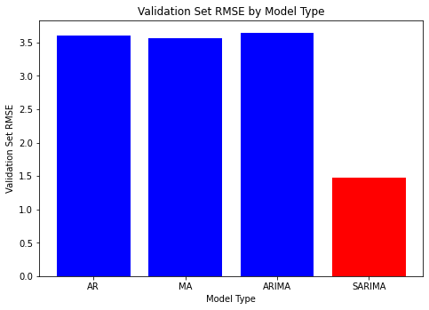
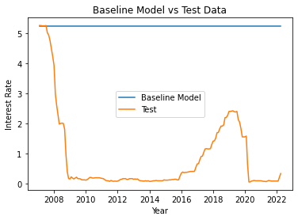
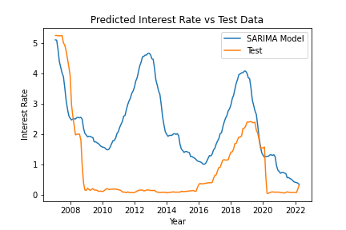
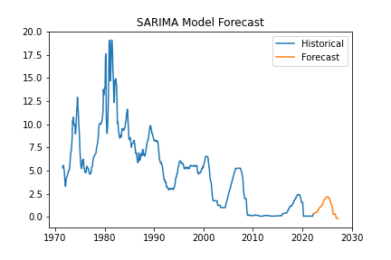

# Federal-Funds-Rate-Analysis

## Overview

We are a data analytics consulting company named Quisitive looking to provide predictive and actionable insights regarding the forward trajectory and absolute level of the Federal Funds Interest Rate using the power of big data. We hope to create a complex time series model that incorporates an Auto Regression and Moving Average order term along with a seasonality and differencing term. We hope to be able to swiftly and effectively achieve forecasted Federal Funds Interest Rate estimates closer to reality than our baseline random walk model. 

The presentation, where we analyze our dataset can be found at:
["Federal Fund Rate Analysis"](Capstone_Presentation.pdf).
## Business Problem

The optimization and prediction of interest rates in the economy has long been a hot topic of study within the financial community. Whether it's credit card rates, mortgages rates, US Treasury rates, or Federal Funds Rate (bank to bank overnight lending rate) economists and analysts alike have long yearned for a tool that can accurately and rapidly forecast interest rates into the future. Here, we are focused on the Federal Funds Rate, a rate that is determined by the Federal Reserve and is the foundation of credit markets. The Federal Reserve has two key mandates, maximum employment and price stability. When either is out of whack, the Fed will adjust monetary policy appropriately. The Federal Reserve uses its ability to adjust short term interest rates and U.S. dollar money supply to control financial conditions which effect consumer behavior. Higher rates equals tighter financial conditions and vice versa. The current high levels of inflation in the U.S. has forced the Fed to raise rates at the most dramatic pace in the last fourty years. Given that the Federal Funds Rate is the shortest term loan, all other longer term interest rates are priced around this metric. We hope to lend our predictive capabilities to key financial institutions and emerging FinTech companies and allow them to accurately price both consumer and interest rate risk. Current credit risk has remained low since COVID with delinquency rates of only around 1.7% ["Federal Reserve Board Charge-Off Rates"](https://www.federalreserve.gov/releases/chargeoff/delallsa.htm). But, on the other hand, high inflation levels has increased interest rate risk. We strive to help these institutions minimize bad debt and reduce credit losses by using our predictive time series model.
## Data Understanding

We are sourcing the data set for this project from the St. Louis Fed FRED Economic Data website, which can be found at ["FRED Federal Funds"](https://fred.stlouisfed.org/series/FEDFUNDS). This data set can also be found at Federal_Funds_Rate.csv in the data folder in the Github Repository. We reviewed 610 monthly Fed Funds rate values from July 1, 1971 to April 1, 2022. We have also sourced various exogenous variables such as GDP, unemployment rate, and CPI for our SARIMAX model, these data files can also be found in both the data folder in the Github Repositiory and on the St. Louis Fed FRED Economic Data website, which can be found at ["FRED Federal Funds Categories"](https://fred.stlouisfed.org/categories). Limitations of our model includes a narrow timeframe data set, lack of independent variables in the models, and our data points are not mutually independent (time series model problem, each data point is dependent on the value before it).

## Modeling and Results

### Validation RMSE For All Models

Here we can see each models performance against the validation set. Oddly, the ARIMA model that combines the AR & MA model performed the worst against the validation set. More research will need to be completed to figure out why. The red bar shows our best model, the SARIMA, which was off by 1.47 percentage points versus the validation set.

### Baseline vs Best Model Against Test Data

Here we can see our final models performance (results_2 model above) against the baseline random walk model for the test data set. Our model was off by 1.92 percentage points against the test set, which is much improved from the 3.49 percentage points see above for the baseline model on the validation set. Our visuals here confirms our calculations.

### SARIMA Model 5 Year Forecast

The five year forecast for our best SARIMA model has interest rates peaking in 2025 and actually going negative in 2026. This is quite the prediction, as the United States has never had negative interest rates, unlike their European and Japanese counterparts.

## Conclusion

The Federal Funds Rate is the shortest term loan interest rate and is the foundation of credit markets. Our best model can be used to help predict and forecast the Federal Funds Rate, which in turn will guide financial institutions and emerging Fintech companies to avoid both credit and interest rate risk. We strive to utilize our model to limit credit/debt losses during periods of high stress and/or inflation. Our model was off by 1.92 percentage points versus the unseen test data which compares to 3.49 percentage points on the baseline Random Walk Model. Our best models AIC score also compares favorably, with an AIC score of 38.8 versus 822 for the baseline model. Lastly, our model forecasts interest rates increasing until 2025 until moving into negative rate territory in 2026, following Europe and Japan previously. With this forward-looking insight, lenders can limit credit losses by reducing exposure to credit on their balance sheet and slowing lending rates until the Federal Funds Rate peaks around 2025.

## Next Steps

* Increase the size of our data set and take in real-time data.
* Acquire more computational power to run models with higher order terms
* Utilize the SARIMAX model with exogenous variables such as unemployment rate, CPI (inflation gauge), and GDP
